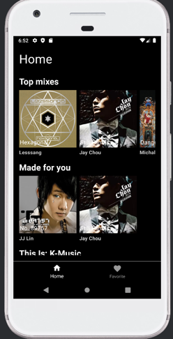
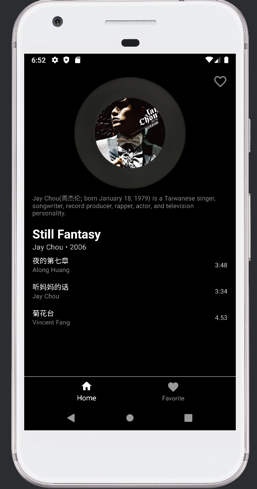
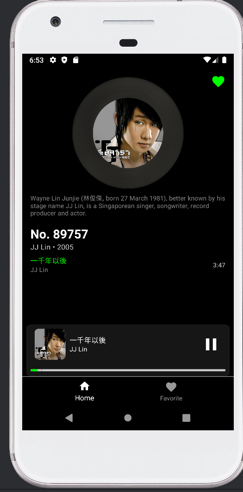
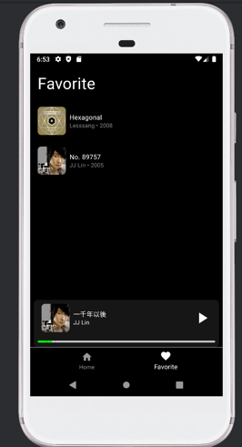

# miniSpotify

miniSpotify is an Android music streaming client implemented in Kotlin, following the MVVM architecture and Repository pattern. It delivers an intuitive and responsive user interface built with Jetpack Compose, seamless networking via Retrofit and OkHttp, and reliable local data persistence with Room. Dependency injection is managed with Hilt to ensure modular, testable code. Users can browse curated playlists, view detailed playlist information, control playback, and manage their favorite content with offline support.

## Tech Stack

- Language: Kotlin
- Architecture: MVVM + Repository Pattern
- UI: Jetpack Compose
- Networking: Retrofit + OkHttp
- Image Loading: Coil
- Local Storage: Room (DAO)
- Dependency Injection: Hilt

## Features

### Home

- Multiple horizontally scrolling sections (e.g. Top Mixes, Made for You, Genre Playlists)
- Lazy-loading of album art and metadata for smooth scrolling
- Error handling and retry logic for network requests

### Playlist Details

- Circular album artwork inside a vinyl-style frame
- Playlist title, artist name, release year, and description
- Scrollable track list showing song titles and durations

### Playback Controls

- Persistent bottom playback bar with current track, artist, and progress indicator
- Play, pause, and seek functionality
- Background playback support

### Favorites

- Tap the heart icon to save playlists or individual tracks
- Dedicated Favorites screen for managing saved items
- Favorite data persisted locally so it survives app restarts

## Screenshots

  
  
  


## Quick Start

1. Clone the repository
   ```bash
   git clone git@github.com:jjMurphy1012/miniSpotify.git
   cd miniSpotify